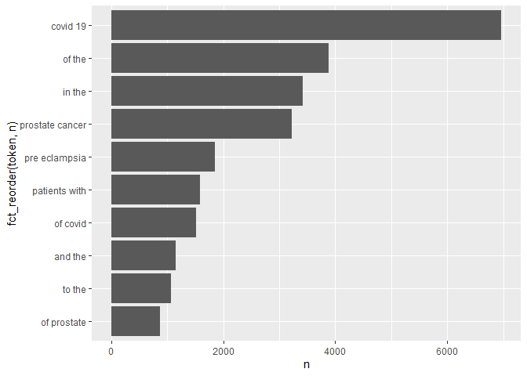

hw3
================
Changqing Su
2020/10/14

``` r
library(httr)
library(xml2)
library(stringr)
library(tidytext)
library(tidyverse)
library(ggplot2)
library(readr)
library(dplyr)
library(data.table)
```

## APIs

``` r
# Downloading the website
website <- xml2::read_html("https://pubmed.ncbi.nlm.nih.gov/?term=sars-cov-2+trial+vaccine")

# Finding the counts
counts <- xml2::xml_find_first(website, "/html/body/main/div[9]/div[2]/div[2]/div[1]/span")

# Turning it into text
counts <- as.character(counts)

# Extracting the data using regex
stringr::str_extract(counts, "[0-9,]+")
```

    ## [1] "564"

So there are 564 results.

``` r
query_ids <- GET(
  url   = "https://eutils.ncbi.nlm.nih.gov/entrez/eutils/esearch.fcgi",
  query = list(
 db="pubmed",
 term="sars-cov-2 trial vaccine",
 retmax=1000
)
)

# Extracting the content of the response of GET
ids <- httr::content(query_ids)

# Turn the result into a character vector
ids <- as.character(ids)


# Find all the ids 
ids <- stringr::str_extract_all(ids, "<Id>[0-9]+</Id>")[[1]]


# Remove all the leading and trailing <Id> </Id>. Make use of "|"
ids <- stringr::str_remove_all(ids, "<Id>|</Id>")
```

``` r
publications <- GET(
  url   = "https://eutils.ncbi.nlm.nih.gov/entrez/eutils/efetch.fcgi",
  query = list(
   db='pubmed',
   id=paste(ids,collapse = ","),
   retmax=1000,
   rettype="abstract"
    )
)
publications <- httr::content(publications)
publications_txt <- as.character(publications)
```

``` r
pub_char_list <- xml2::xml_children(publications)
pub_char_list <- sapply(pub_char_list, as.character)
```

Get abstract of the paper:

``` r
abstracts <- str_extract(pub_char_list, "<Abstract>(\\n|.)+</Abstract>")
abstracts <- str_remove_all(abstracts, "</?[[:alnum:]]+>")
abstracts <- str_replace_all(abstracts, "\\s+"," ")
```

Get name of the journal where it was published:

``` r
jtitles <- str_extract(pub_char_list, "<Title>(\\n|.)+</Title>")
jtitles <- str_remove_all(jtitles, "</?[[:alnum:]]+>")
jtitles <- str_replace_all(jtitles, "\\s+"," ")
```

Get title of the paper:

``` r
atitles <- str_extract(pub_char_list, "<ArticleTitle>(\\n|.)+</ArticleTitle>")

atitles <- str_remove_all(atitles, "</?[[:alnum:]]+>")
atitles <- str_replace_all(atitles, "\\s+"," ")
```

Get publication date:

``` r
pubdate <- str_extract(pub_char_list, "<PubDate>(\\n|.)+</PubDate>")
pubdate <- str_remove_all(pubdate, "</?[[:alnum:]]+>")
pubdate <- str_replace_all(pubdate, "\\s+"," ")
```

``` r
database <- data.frame(
  PubMedID=ids,
  PaperTitle=atitles,
  JournalNames=jtitles,
  PublicationDate=pubdate,
  abstracts=abstracts
)
knitr::kable(head(database))
```

| PubMedID | PaperTitle                                                                             | JournalNames                                               | PublicationDate | abstracts                                                                                                                                                                                                                                                                                                                                                                                                                                                                                                                                                                                                                                                                                                                                                                                                                                                                                                                                                                                                                                                                                                                                                                                                                                                                                                                                                                                                                                                                                                                                                                                                                                                                                                                                                                                                                                                                                                                                                                                                                                                                                |
| :------- | :------------------------------------------------------------------------------------- | :--------------------------------------------------------- | :-------------- | :--------------------------------------------------------------------------------------------------------------------------------------------------------------------------------------------------------------------------------------------------------------------------------------------------------------------------------------------------------------------------------------------------------------------------------------------------------------------------------------------------------------------------------------------------------------------------------------------------------------------------------------------------------------------------------------------------------------------------------------------------------------------------------------------------------------------------------------------------------------------------------------------------------------------------------------------------------------------------------------------------------------------------------------------------------------------------------------------------------------------------------------------------------------------------------------------------------------------------------------------------------------------------------------------------------------------------------------------------------------------------------------------------------------------------------------------------------------------------------------------------------------------------------------------------------------------------------------------------------------------------------------------------------------------------------------------------------------------------------------------------------------------------------------------------------------------------------------------------------------------------------------------------------------------------------------------------------------------------------------------------------------------------------------------------------------------------------------- |
| 33043110 | EXPLORING SURFACE GLYCOPROTEIN TO DESIGN MULTI-EPITOPE VACCINE AGAINST COVID-19.       | Informatics in medicine unlocked                           | 2020 Oct 04     | Stimulation and generation of T and B cell mediated long-term immune response is essential for the curbing of a deadly virus such as SAR-CoV-2. Immunoinformatics approach in vaccine design takes advantage of antigenic and non-allergenic epitopes present on the spike glycoprotein of SARS-CoV-2 to elicit immune responses. T cells and B cells epitopes were predicted, and the selected residues were subjected to allergenicity, antigenicity and toxicity screening which were linked by appropriate linkers to form a multi-epitope subunit vaccine. The physiochemical properties of the vaccine construct was analyzed and the molecular weight, molecular formula, theoretical isoelectric point value, half-life, solubility score, instability index, aliphatic index and GRAVY were predicted. The vaccine structure was constructed, refined, validated, and disulfide engineered to get the best model. Molecular binding simulation and molecular dynamics simulation were carried out to predict the stability and binding affinity of the vaccine construct with TLRs. Codon acclimatization and in silico cloning were performed to confirm the vaccine expression and potency. Results obtained indicated that this novel vaccine candidate is non-toxic, capable of initiating the immunogenic response and will not induce an allergic reaction. The highest binding energy was observed in TLR 4 (-1398.1) and the least is TLR 2 (-1479. 6). The steady rise in Th (helper) cell population with memory development was noticed and IFN-g was provoked after simulation. At this point, the vaccine candidate awaits animal trial to validate its efficacy and safety for use in the prevention of the novel COVID-19 infections. © 2020 The Author(s).                                                                                                                                                                                                                                                                                                      |
| 33042591 | Impact of COVID-19 on clinical trials and clinical research: A systematic review.      | Nepal journal of epidemiology                              | 2020 Sep        | Background: The World Health Organization has reported more than 31,186,000 confirmed cases of coronavirus disease-19 (COVID-19), including 962,343 deaths, worldwide as on September 21, 2020. The current COVID-19 pandemic is affecting clinical research activities in most parts of the world. The focus on developing a vaccine for SARS-CoV-2 and the treatment of COVID-19 is, in fact, disrupting many upcoming and/or ongoing clinical trials on other diseases around the globe. On March 18, 2020, the United States Food and Drug Administration (FDA) issued an updated guideline for the conduct of clinical trials during the current health emergency situation. The potential challenges, such as social distancing and quarantines, result in study participants’ inaccessibility and trial personnel for in-person scheduled study visits and/or follow-up. Due to the sudden onset and wide-spread impact of COVID-19, its influence on the management of clinical trials and research necessitates urgent attention. Therefore, our systematic review of the literature aims to assess the impact of the COVID-19 pandemic on the conduction of clinical trials and research. The search for the relevant articles for review included the keywords “COVID-19” AND “clinical trial” in PubMed, MEDLINE, Embase, Google scholar and Google electronic databases. Key findings include: delaying subject enrollment and operational gaps in most ongoing clinical trials, which in turn has a negative impact on trial programmes and data integrity. Globally, most sites conducting clinical trials other than COVID-19 are experiencing a delay in timelines and a complete halt of operations in lieu of this pandemic, thus affecting clinical research outcomes. © 2020 CEA& INEA.                                                                                                                                                                                                                                                                             |
| 33038433 | COVID-19: discovery, diagnostics and drug development.                                 | Journal of hepatology                                      | 2020 Oct 07     | An epidemic of acute respiratory syndrome (Covid-19) started in humans in Wuhan in 2019, and became a pandemic. Groups from China Identified and sequenced the virus responsible for COVID-19, named SARS-CoV-2, and determined that it was a novel coronavirus (CoV) that shared high sequence identity with bat- and pangolin-derived SARS-like CoVs, suggesting a zoonotic origin. SARS-CoV-2 is a member of Coronaviridae, a family of enveloped, positive-sense, single-stranded RNA viruses that infect a broad range of vertebrates. The rapid release of the sequence of the virus has allowed the development of diagnostic tools (e.g., RT-PCR). Additionally, serological tests can allow identification of persons who have been infected. In humans, CoVs tend to cause mild to moderate upper respiratory tract infections. The fatality rate is around 1-3% for infected persons. An acute respiratory distress syndrome (ARDS) likely due to an uncontrolled immune activation (“cytokine storm”) occurs in patients with severe disease and poor prognosis. Risk factors for mortality include: advanced age, obesity, diabetes, hypertension and other comorbidities. Drug repurposing has been used to rapidly identify potential treatment for COVID-19, which could move quickly to phase-3. Better knowledge of the virus, its enzymes, will be mandatory to develop more potent and specific direct-acting antiviral agents (DAA). In the long term, a vaccine to prevent infection would be crucial; however even if successful it might not be available before 2021-22. To date, with the exception of intravenous Remdesivir and dexamethasone, which have modest effects in moderate to severe COVID-19, no strong clinical evidence supports the efficacy and safety of any other drugs against SARS-CoV-2. The aim of this review is to provide insights on the discovery of SARS-CoV-2, its virology, the diagnostic tools, and the ongoing drug discovery effort. Copyright © 2020 European Association for the Study of the Liver. All rights reserved. |
| 33022293 | Clinical trial protocols of repurposed prophylaxis for COVID-19: a review.             | Medecine et maladies infectieuses                          | 2020 Oct 03     | Efficient therapeutic strategies are needed to counter the COVID-19 pandemic, caused by the SARS-CoV-2 virus. In a context where specific vaccines are not yet available, the containment of the pandemic would be facilitated with efficient prophylaxis. We screened several clinical trials repositories and platforms in search of the prophylactic strategies being investigated against COVID-19 in July 2020. Up to July 5, 2020, only one clinical trial result was published, although we found 112 clinical trial protocols targeting medical workers (n=70, 63%), patients relatives (n=20, 18%) or individuals at risk of severe COVID-19 (n=14, 13%). (Hydroxy)chloroquine was the most frequently evaluated treatment (n=69, 62%), before BCG vaccine (n=12, 11%), this followed by numerous antivirals and immune enhancers. Ninety-eight (88%) clinical trials were randomized with a median of planned inclusions of 530 (IQR 258-1299). Both pre- and post-exposure prophylaxes are investigated. Copyright © 2020 Elsevier Masson SAS. All rights reserved.                                                                                                                                                                                                                                                                                                                                                                                                                                                                                                                                                                                                                                                                                                                                                                                                                                                                                                                                                                                                           |
| 33013255 | Screening of FDA Approved Drugs Against SARS-CoV-2 Main Protease: Coronavirus Disease. | International journal of peptide research and therapeutics | 2020 Sep 28     | At the end of December 2019, a new strain of coronavirus was identified in the Wuhan city of Hubei province in China. Within a shorter period of time, an unprecedented outbreak of this strain was witnessed over the entire Wuhan city. This novel coronavirus strain was later officially renamed as COVID-19 (Coronavirus disease 2019) by the World Health Organization. The mode of transmission was human-to-human contact and hence resulted in a rapid surge across the globe where more than 24 million people have been infected with COVID-19. In the current scenario, finding potent drug candidates for the treatment of COVID-19 has emerged as the most challenging task for clinicians and researchers worldwide. Identification of new drugs and vaccine development may take from a few months to years based on the clinical trial processes. To overcome the several limitations involved in identifying and bringing out potent drug candidates for treating COVID-19, in the present study attempts were made to screen the FDA approved drugs using High Throughput Virtual Screening (HTVS). The COVID-19 main protease (COVID-19 Mpro) was chosen as the drug target for which the FDA approved drugs were initially screened with HTVS. The drug candidates that exhibited favorable docking score, energy, and emodel calculations were further taken for performing Induced Fit Docking (IFD) using Schrodinger’s GLIDE. From the flexible docking results, the following four FDA approved drugs Sincalide, Pentagastrin, Ritonavir, and Phytonadione were identified. In particular, Sincalide and Pentagastrin can be considered potential key players for the treatment of COVID-19 disease. © Springer Nature B.V. 2020.                                                                                                                                                                                                                                                                                                                              |
| 33012348 | SARS-CoV-2 Vaccine Development: Current Status.                                        | Mayo Clinic proceedings                                    | 2020 10         | In the midst of the severe acute respiratory syndrome coronavirus 2 pandemic and its attendant morbidity and mortality, safe and efficacious vaccines are needed that induce protective and long-lived immune responses. More than 120 vaccine candidates worldwide are in various preclinical and phase 1 to 3 clinical trials that include inactivated, live-attenuated, viral-vectored replicating and nonreplicating, protein- and peptide-based, and nucleic acid approaches. Vaccines will be necessary both for individual protection and for the safe development of population-level herd immunity. Public-private partnership collaborative efforts, such as the Accelerating COVID-19 Therapeutic Interventions and Vaccines mechanism, are key to rapidly identifying safe and effective vaccine candidates as quickly and efficiently as possible. In this article, we review the major vaccine approaches being taken and issues that must be resolved in the quest for vaccines to prevent coronavirus disease 2019. For this study, we scanned the PubMed database from 1963 to 2020 for all publications using the following search terms in various combinations: SARS, MERS, COVID-19, SARS-CoV-2, vaccine, clinical trial, coronavirus, pandemic, and vaccine development. We also did a Web search for these same terms. In addition, we examined the World Health Organization, Centers for Disease Control and Prevention, and other public health authority websites. We excluded abstracts and all articles that were not written in English. Copyright © 2020 Mayo Foundation for Medical Education and Research. Published by Elsevier Inc. All rights reserved.                                                                                                                                                                                                                                                                                                                                                                                              |

## Test mining

#### Ques 1:

``` r
pubmed=read_csv("https://raw.githubusercontent.com/USCbiostats/data-science-data/master/03_pubmed/pubmed.csv")
```

    ## Parsed with column specification:
    ## cols(
    ##   abstract = col_character(),
    ##   term = col_character()
    ## )

``` r
pubmed %>%
  unnest_tokens(output=token, input=abstract) %>%
  count(token, sort = T) %>%
  top_n(n=50, wt=n) 
```

    ## # A tibble: 50 x 2
    ##    token     n
    ##    <chr> <int>
    ##  1 the   28126
    ##  2 of    24760
    ##  3 and   19993
    ##  4 in    14653
    ##  5 to    10920
    ##  6 a      8245
    ##  7 with   8038
    ##  8 covid  7275
    ##  9 19     7080
    ## 10 is     5649
    ## # ... with 40 more rows

The top most frequent words are all stopwords, so we need to remove
those.

``` r
  token_pub=unnest_tokens(pubmed,output=token, input=abstract) %>%
  anti_join(stop_words, by= c("token"="word")) %>%
  filter(! (token %in% as.character(seq(0,100, by=1)))) 
  count_token=count(token_pub,token, sort = T, by=term) 
  count_token=data.table(count_token, key="by")
  knitr::kable(count_token[, head(.SD, 5), by=by])
```

| by              | token        |    n |
| :-------------- | :----------- | ---: |
| covid           | covid        | 7275 |
| covid           | patients     | 2293 |
| covid           | disease      |  943 |
| covid           | pandemic     |  800 |
| covid           | coronavirus  |  647 |
| cystic fibrosis | fibrosis     |  867 |
| cystic fibrosis | cystic       |  862 |
| cystic fibrosis | cf           |  625 |
| cystic fibrosis | patients     |  586 |
| cystic fibrosis | disease      |  400 |
| meningitis      | patients     |  446 |
| meningitis      | meningitis   |  429 |
| meningitis      | meningeal    |  219 |
| meningitis      | csf          |  206 |
| meningitis      | clinical     |  187 |
| preeclampsia    | pre          | 2038 |
| preeclampsia    | eclampsia    | 2005 |
| preeclampsia    | preeclampsia | 1863 |
| preeclampsia    | women        | 1196 |
| preeclampsia    | pregnancy    |  969 |
| prostate cancer | cancer       | 3840 |
| prostate cancer | prostate     | 3832 |
| prostate cancer | patients     |  934 |
| prostate cancer | treatment    |  926 |
| prostate cancer | disease      |  652 |

The 5 most common tokens for each search term were shown above.

#### Ques 2:

``` r
pubmed %>%
  unnest_ngrams(output=token, input=abstract, n=2) %>%
  count(token, sort = T) %>%
  top_n(n=10, wt=n) %>%
  ggplot(aes(x=n,y=fct_reorder(token,n))) + 
  geom_col()
```

<!-- -->

#### Ques 3:

``` r
tfidf= pubmed %>%
  unnest_tokens(abstract, abstract) %>%
  count(abstract, term) %>%
  bind_tf_idf(abstract, term, n) %>%
  arrange(desc(tf_idf))
tfidf=data.table(tfidf, key= "term")
 knitr::kable(tfidf[, head(.SD, 5),.SDcols = c("abstract","tf_idf"), by=term])
```

| term            | abstract        |   tf\_idf |
| :-------------- | :-------------- | --------: |
| covid           | covid           | 0.0597183 |
| covid           | pandemic        | 0.0065670 |
| covid           | coronavirus     | 0.0053110 |
| covid           | sars            | 0.0030536 |
| covid           | cov             | 0.0027417 |
| cystic fibrosis | cf              | 0.0116541 |
| cystic fibrosis | fibrosis        | 0.0090127 |
| cystic fibrosis | cystic          | 0.0089608 |
| cystic fibrosis | cftr            | 0.0028167 |
| cystic fibrosis | sweat           | 0.0027184 |
| meningitis      | meningitis      | 0.0147974 |
| meningitis      | meningeal       | 0.0075539 |
| meningitis      | pachymeningitis | 0.0051394 |
| meningitis      | csf             | 0.0040453 |
| meningitis      | meninges        | 0.0036562 |
| preeclampsia    | eclampsia       | 0.0229802 |
| preeclampsia    | preeclampsia    | 0.0213527 |
| preeclampsia    | pregnancy       | 0.0035250 |
| preeclampsia    | maternal        | 0.0028993 |
| preeclampsia    | gestational     | 0.0021891 |
| prostate cancer | prostate        | 0.0501967 |
| prostate cancer | androgen        | 0.0039953 |
| prostate cancer | psa             | 0.0036940 |
| prostate cancer | prostatectomy   | 0.0028164 |
| prostate cancer | castration      | 0.0019387 |

The 5 tokens from each search term with the highest TF-IDF value are
shown above. However, the results are very different from the results in
question 1. Only a few tokens appear in both results.
